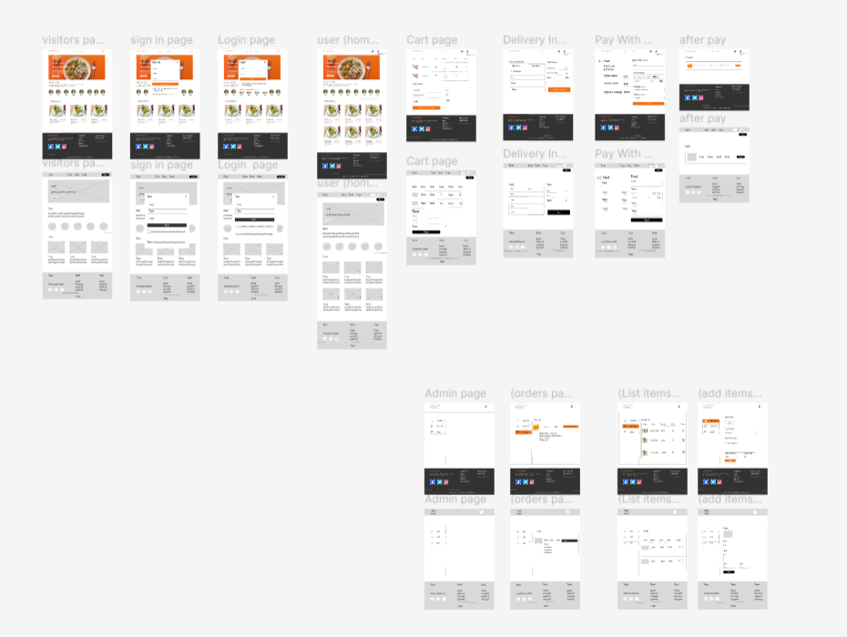

# CustomPlateHub

## Description
CustomPlateHub is a full-stack web application developed using the MERN stack, designed to provide a unique platform for ordering customized meals tailored to individual dietary needs and preferences. Whether you're a regular customer, a patient with specific dietary requirements, or an athlete seeking specialized nutrition, CustomPlateHub caters to your needs. Users can easily place their food orders specifying dietary preferences, and we ensure prompt preparation and delivery of their personalized meals.

## Competitive Advantage
Our competitive edge lies in our focus on personalized food solutions. Unlike traditional food delivery services, CustomPlateHub ensures that each meal meets the unique dietary requirements and preferences of our diverse customer base. This tailored approach enhances customer satisfaction and loyalty, setting us apart in the market.

## Features

- Seamless meal tracking and delivery status
- Admin dashboard for managing orders and users

## Screenshots

## Design Tools
We used Figma to design wireframes and mockups for CustomPlateHub. You can view them here:
- [Figma Wireframes & Mockups](https://www.figma.com/design/h0P5hdJrFFtt8cFpkdQysA/Food?node-id=1-2&t=p6G3Fj6Ko2ORxCS4-0)

